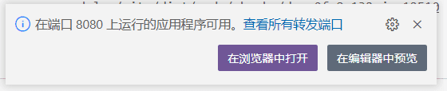
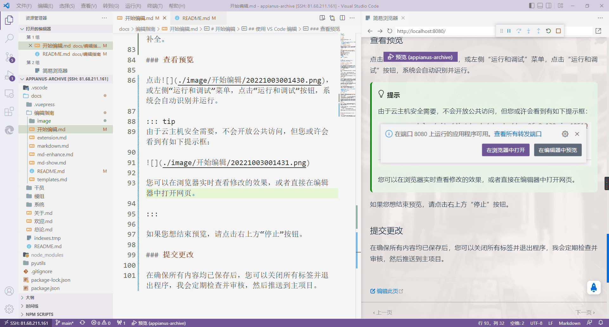

# 开始编辑

## 在此之前...

假定您已经阅读了[编辑指南](./)。

## 编辑原则

- 可能某种格式可以用多种形式实现，但**用什么符号开启标签，就要用什么符号结束**
- 每个页面至多 1 个一级标题
- 其他的想到再写

## 关于页面元数据 (Frontmatter)

您或许已经注意到每个`.md`文档开头都有段三条短横框起来的内容，您可以用它定义当前页面的标题、图标、目录和标签。

```md
---
# 如果您不想定义某个属性，请删掉它，不要留空
title: 页面标题 # 如不设置，页面标题将是本页第一个一级标题
icon: 页面图标
author: 作者，不写默认档案馆
# 分类的写法**三选一**
category: 分类
category: [分类1, 分类2]
category:
  - 分类1
  - 分类2
tags: 标签 # 方法同上
---
```

::: tip
关于可使用的图标，请参考[这里](https://nemo1166.github.io/akicons/)。
:::

## 编辑页面 - 使用 GitHub 在线编辑器

### GitHub 在线编辑器的使用

它是一个纯文本编辑器，不过如果您想向其中插入图片，可以直接拖入或复制图片并粘贴，上传完毕后会自动转换成 [Markdown 语法](./md-show.html#图片)。如果您之后想将其移动到其他位置，请确保**完整地**复制生成的图片代码。

### 编辑之后

如果是单个页面的编辑，可以在这里写一些说明然后提交。


提交更改会将其写入新分支，以便您可以发送拉取请求 (Pull Request, PR)。

再次声明，请不要直接向主项目提交（您自行 fork 的项目无所谓）。

### 开始合并

有时您可能想要修改多个内容，可以在自行 fork 的项目中进行一系列修改，然后向主项目发起拉去请求。创建 PR 后，页面构建 bot 会自动执行构建操作，等待构建完成后如果顺利，将显示如下内容：


此时您可以点击预览链接查看显示效果。如果提示编译失败，则可能是编辑的内容出现了问题。

## 使用 VS Code 编辑

安装完必要的插件后，您可以点击左下角  然后选择 `Connect to Host...` 创建远程连接。

- 地址：appianus@::heimu|~~1.2.3.4~~我怎么可能把这种东西公开呢::
- 密码：::heimu|群里问我要::
- 平台：Linux
- 是否继续：Continue

### 开始编辑

点击左侧“打开文件夹”，选择`appianus-archive`，然后就可以打开这个文件夹（可能需要再输入一次密码）并开始编辑。

文档的主要内容位于`./docs`目录下，其余目录（包括`./docs/.vuepress`）为网页运行必要的文件，一般情况下不需要修改（也不要随意移动）。

如果您想插入图片，请先把图片上传到对应文件夹（随意，但要好找并且方便后续管理），然后插入图片代码。如果您安装了代码提示插件，在输入路径时会自动补全。

注：建议上传图片前先压缩一下，例如用[这个](https://www.iloveimg.com/zh-cn/compress-image)。

### 查看预览

点击，或左侧“运行和调试”菜单，点击“运行和调试”按钮，系统会自动识别并运行。

::: tip
由于云主机安全需要，不会开放公共访问，但您或许会看到有如下提示框：



您可以在浏览器实时查看修改的效果，或者直接在编辑器中打开网页，如下图所示。



:::

如果您想结束预览，请点击右上方“停止”按钮。

### 提交更改

在确保所有内容均已保存后，您可以关闭所有标签并退出程序，我会定期检查并审核，然后推送到主项目。